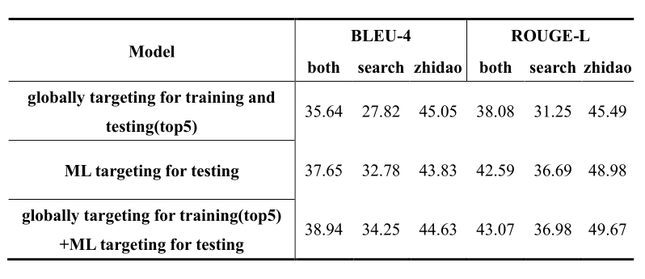

## 评价指标
### BLEU-4
BLEU计算公式 

N 元文法的 BLEU 分数原理是在候选答案 N 元的准确率（右项，大括号，
一种几何平均）的基础上加上适当的长度惩罚(左项，BP：brevity penalty），因此相对侧重答案的准确率，其中每 N 元计算的准确率的公式
 
即候选答案命中参考答案的 N 元个数在候选答案 N 元中的占比（也就是 N 元准确率。

### ROUGE_L
ROUGE-L 值计算的原理是考察候选答案和参考答案的最长公共子序列上
的准确和召回情况，其中 R 为最长公共子序列在参考答案上的召回率，P 为最
长公共子序列在候选答案上的准确率。

## 超参设置

| embed_size | hidden_size | learning_rate | batch | question_len | paragraph_len |answer_len|
|---|---|---|---|---|---|---|
| 300 | 150 | 0.001 | 32 | 60 | 500 |200|

## 实验结果
### 模型改进后的实验结果

### 答案预筛选改进后最终模型结果

最终模型在 BLEU-4 上提升了 6.25 个点，在 ROUGE-L 上提升了 4.79 个
点。