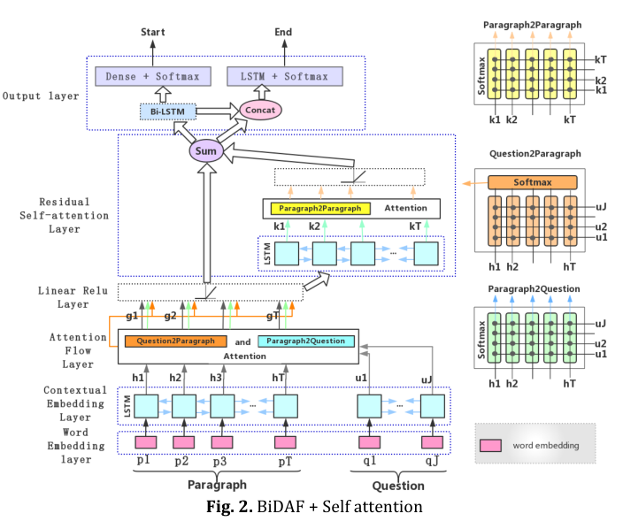

# 2018百度机器阅读理解竞赛
## 竞赛简介
机器阅读理解(Machine Reading Comprehension)是指让机器阅读文本，然后回答和阅读内容相关的问题。阅读理解是自然语言处理和人工智能领域的重要前沿课题，对于提升机器智能水平、使机器具有持续知识获取能力具有重要价值，近年来受到学术界和工业界的广泛关注。

为了促进阅读理解技术发展，[中国中文信息学会](http://www.cipsc.org.cn/)、[中国计算机学会](http://www.ccf.org.cn/)和[百度公司](http://home.baidu.com/)联手举办“2018机器阅读理解技术竞赛”。竞赛将提供面向真实应用场景的大规模中文阅读理解数据集， 旨在为研究者提供学术交流平台，进一步提升阅读理解的研究水平， 推动语言理解和人工智能领域技术和应用的发展。竞赛将在第三届“[语言与智能高峰论坛](http://tcci.ccf.org.cn/summit/2017/index.php)”举办技术交流和颁奖。诚邀学术界和工业界的研究者和开发者参加本次竞赛！

## 竞赛详情
### 1. 竞赛任务

对于给定问题_q_及其对应的文本形式的候选文档集合_D=d1, d2, ..., dn，_要求参评阅读理解系统自动对问题及候选文档进行分析， 输出能够满足问题的文本答案a。目标是a能够正确、完整、简洁地回答问题_q_。

### 2. 数据简介 
[数据详情](https://github.com/jingyihiter/myDuReader/blob/master/Data_introduction.md)
本次竞赛数据集来自搜索引擎真实应用场景，其中的问题为百度搜索用户的真实问题，每个问题对应5个候选文档文本及人工整理的优质答案。

数据集共包含30万问题，包括27万的训练集，1万开发集和2万测试集。其中20万数据已在[DuReader](https://arxiv.org/abs/1711.05073)发布，包括18万训练集、1万的开发集和1万的测试集。这部分数据可自由下载（[下载地址](https://ai.baidu.com/broad/introduction?dataset=dureader)），供参赛者训练和测试使用。报名截止后，新增的10万数据集也将在数据下载区发布。

### 3. 评价方法

竞赛基于测试集的人工标注答案，采用[ROUGH-L](http://www.aclweb.org/anthology/W/W04/W04-1013.pdf)和[BLEU4](http://aclweb.org/anthology/P/P02/P02-1040.pdf)作为评价指标，以[ROUGH-L](http://www.aclweb.org/anthology/W/W04/W04-1013.pdf)为主评价指标。针对是非及实体类型问题，对ROUGE-L和BLEU4评价指标进行了微调， 适当增加了正确识别是非答案类型及匹配实体的得分奖励， 一定程度上弥补传统ROUGE-L和BLEU4指标对是非和实体类型问题评价不敏感的问题。

*详细的评价指标说明参见数据集中包含的“评测细则“文档。

### 4. 基线系统

竞赛将提供两个开源的阅读理解基线系统，基线系统的实现及结果评价请参考：[开源系统](https://github.com/baidu/DuReader)和数据集[论文](https://arxiv.org/abs/1711.05073)。

## 主要模型

### [实验](Experiment.md)
## 最终排名
[排行榜](http://mrc2018.cipsc.org.cn/cipsc)

